# Maven 入门和进阶

# 一、Maven 快速入门

## 1.1 Maven 概述

[Maven 官网](https://maven.apache.org/what-is-maven.html) Maven 是一款为 Java 项目构建管理、依赖管理的工具（**软件**），使用 Maven 可以自动化构建、测试、打包和发布项目，大大提高开发效率和质量。

## 1.2 Maven 的作用

maven 通过引入场景概念来管理项目，对项目中用到的依赖以及项目完成后打包构建过程进行统一。

- 例如我们项目需要第三方库（依赖），如 Druid 连接池、MySQL 数据库驱动和 Jackson 等。那么我们可以将需要的依赖项的信息编写到 Maven 工程的配置文件，Maven 软件就会自动下载并复制这些依赖项到项目中，也会自动下载依赖需要的依赖！确保依赖版本正确无冲突和依赖完整！
- 项目开发完成后，想要将项目打成 .war 文件，并部署到服务器中运行，使用 Maven 软件，我们可以通过一行构建命令（mvn package）快速项目构建和打包！节省大量时间！

总之通过 Maven 我们可以极大地提高开发效率以及质量。引入场景概念后，接下来我们介绍 Maven 作用：

	1. 依赖管理
	1. 构建管理

### 1.2.1 依赖管理

Maven 可以管理项目的依赖，包括自动下载所需依赖库、自动下载依赖需要的依赖并且保证版本没有冲突、依赖版本管理等。通过 Maven，我们可以方便地维护项目所依赖的外部库，而我们仅仅需要编写配置即可,那么我们如何编写相关的配置呢？

Maven工程相对之前的工程，多出一组 gavp 属性，gav 需要我们在创建项目的时指定，p 有默认值（jar）下面我们来了解一下什么是 gavp 以及如何通过 gavp 确定相关依赖：

Maven 中的 GAVP 是指 GroupId、ArtifactId、Version、Packaging 等四个属性的缩写，其中前三个是必要的，而 Packaging 属性为可选项。这四个属性主要为每个项目在 maven 仓库总做一个标识，类似人的《姓-名》。有了具体标识，方便 maven 软件对项目进行管理和互相引用！	

#### 1.2.1.1 GAVP 相关的规范

**GAV遵循一下规则：**

  1） **GroupID 格式**：com.{公司/BU }.业务线.[子业务线]，最多 4 级。

    说明：{公司/BU} 例如：alibaba/taobao/tmall/aliexpress 等 BU 一级；子业务线可选。
    
    正例：com.taobao.tddl 或 com.alibaba.sourcing.multilang  com.atguigu.java

  2） **ArtifactID 格式**：产品线名-模块名。语义不重复不遗漏，先到仓库中心去查证一下。

    正例：tc-client / uic-api / tair-tool / bookstore

  3） **Version 版本号格式推荐**：主版本号.次版本号.修订号 1.0.0

    1） 主版本号：当做了不兼容的 API 修改，或者增加了能改变产品方向的新功能。
    
    2） 次版本号：当做了向下兼容的功能性新增（新增类、接口等）。
    
    3） 修订号：修复 bug，没有修改方法签名的功能加强，保持 API 兼容性。
    
    例如： 初始→1.0.0  修改bug → 1.0.1  功能调整 → 1.1.1等

**Packaging 定义规则：**

  指示将项目打包为什么类型的文件，idea 根据 packaging 值，识别 maven 项目类型

- packaging 属性为 jar（默认值），代表普通的Java工程，打包以后是 .jar 结尾的文件。
- packaging 属性为 war，代表Java的web工程，打包以后 .war 结尾的文件。
- packaging 属性为 pom，代表不会打包，用来做继承的父工程。

### 1.2.2 构建管理

项目构建是指将源代码、配置文件、资源文件等转化为能够运行或部署的应用程序或库的过程！

Maven 可以管理项目的编译、测试、打包、部署等构建过程。通过实现标准的构建生命周期，Maven 可以确保每一个构建过程都遵循同样的规则和最佳实践。同时，Maven 的插件机制也使得开发者可以对构建过程进行扩展和定制。主动触发构建，只需要简单的命令操作即可。

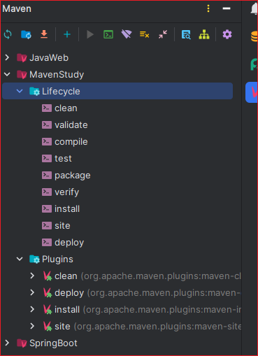

## 1.3 Maven 的安装和配置

### 1.3.1 Maven 的下载

[Maven 官网下载](https://maven.apache.org/download.cgi)

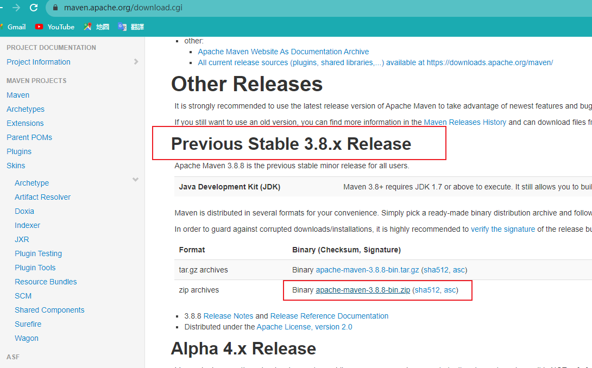

### 1.3.2 Maven 配置

#### 1.3.2.1 环境变量的配置 

Maven 需要有 Java 环境支持~ 😢

1. 添加环境变量 `MAVEN_HOME` 至系统变量

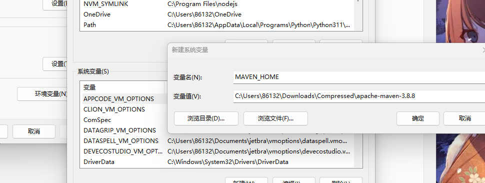

2. 将  `bin ` 目录引入至  `path ` 中

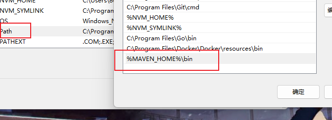

3. 验证

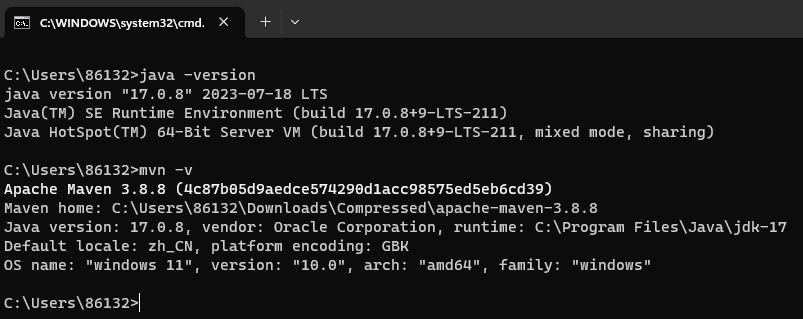


#### 1.3.2.2 本地仓库配置

```xml
  <localRepository>C:\Users\86132\Downloads\Compressed\apache-maven-3.8.8\repo</localRepository>
```

其中键值为存储仓库的绝对路径 （此处 repo 为自行在 maven 目录下创建的）

#### 1.3.2.3 镜像源的配置

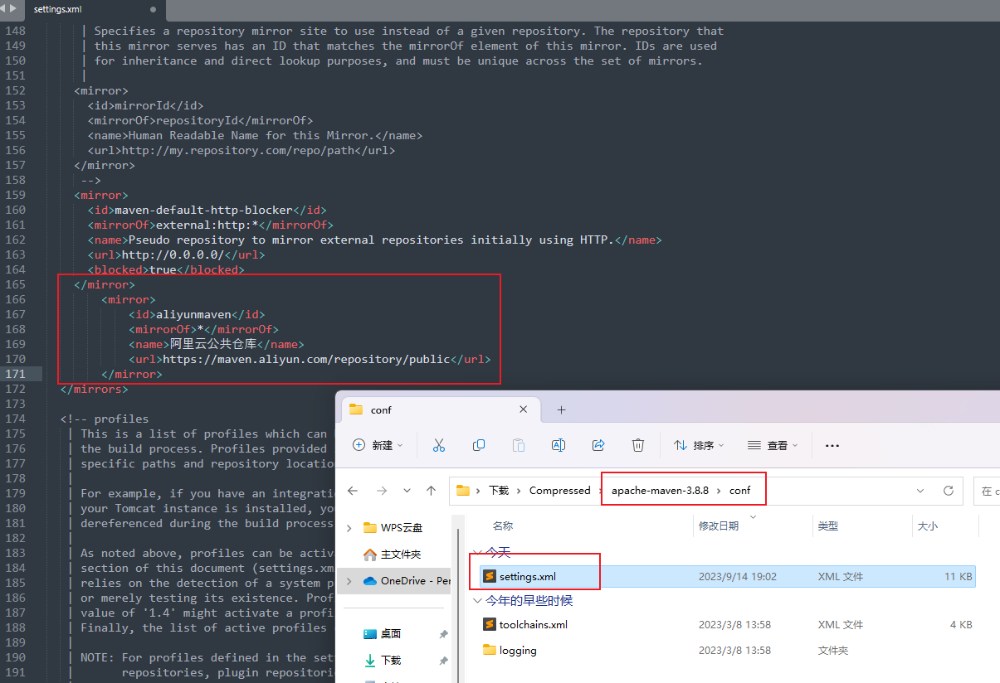

```xml
<mirror>
    <id>aliyunmaven</id>
    <mirrorOf>*</mirrorOf>
    <name>阿里云公共仓库</name>
    <url>https://maven.aliyun.com/repository/public</url>
</mirror>
```

#### 1.3.2.4 代理配置

按需配置~

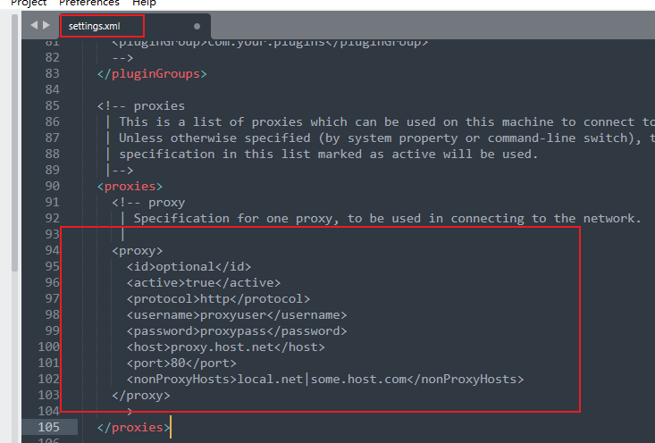

#### 1.3.2.5 IDEA 中 Maven 的配置

- 配置当前项目的 Maven

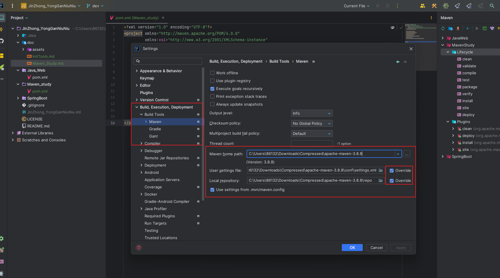

- 配置新创建项目的 Maven

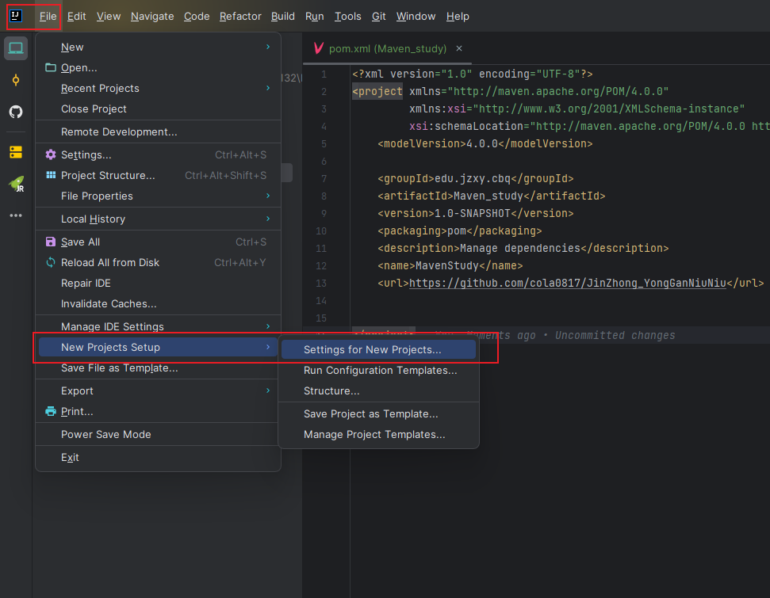

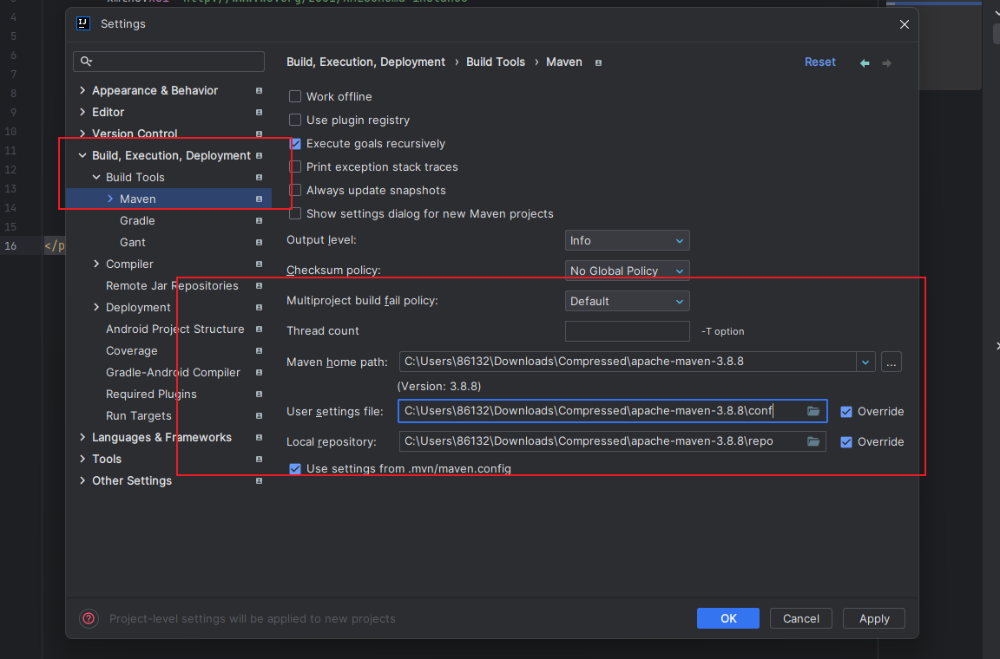

# 二、在 IDEA 中使用 Maven 

在 IDEA 中我们可以快速创建不同类型的 Maven 工程，下面我们介绍常用的两种项目在 IDEA 中的构建方法：

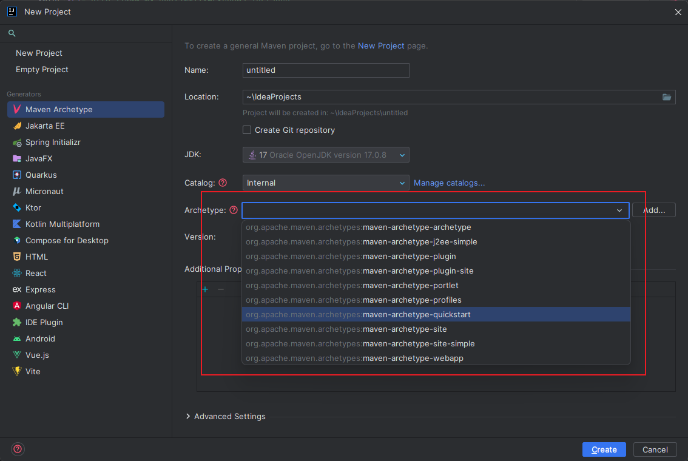

## 2.1 使用 IDEA 构建 Maven JavaSE 工程

使用 IDEA 构建 Maven JavaSE 比较简单此处不做过多说明

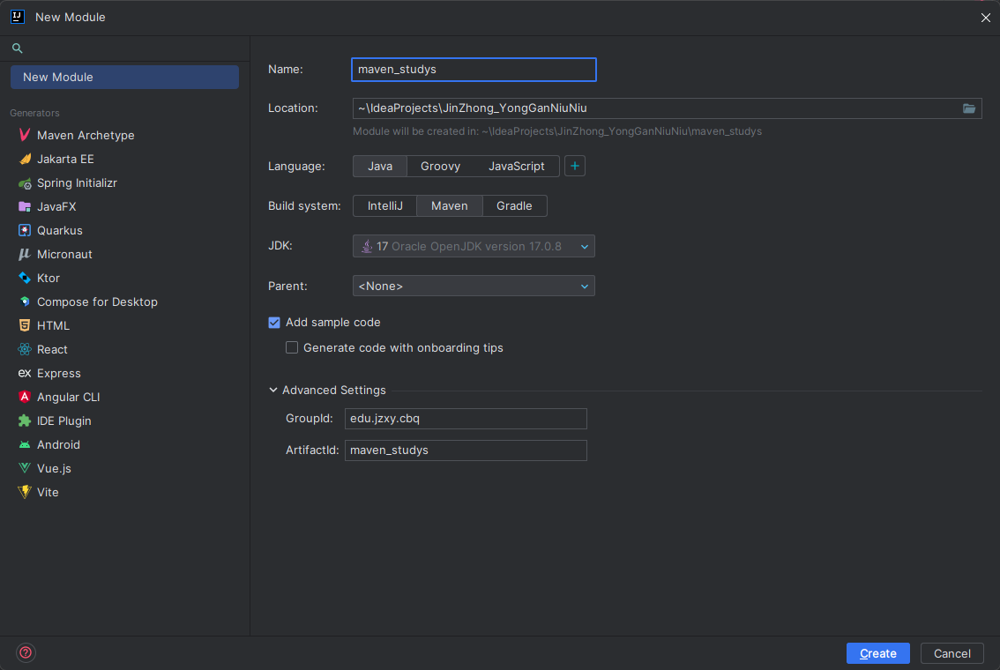

## 2.2 使用 IDEA 构建 Maven JavaEE 工程

介绍完 JavaSE 项目的构建后，我们着重说明一下如何使用 Maven 构建 JavaEE 工程，使用 IDEA 构建 Maven JavaEE 有两种方式：

- 通过 Maven 模板创建 （存在网络问题，需要修改为 内部 TODO）
- 通过插件快速构建

#### 2.2.1 通过 Maven 模板创建

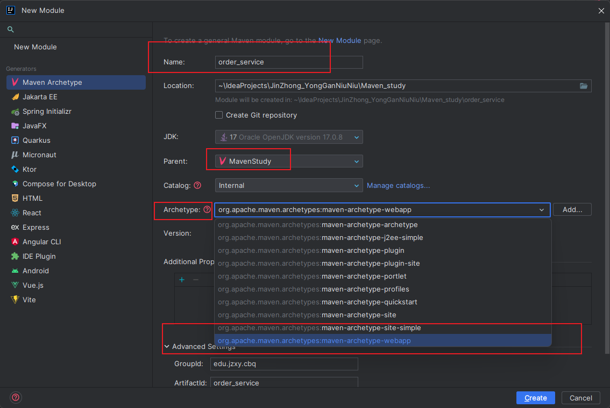

#### 2.2.2 通过插件快速构建

我们可以使用 JBLJavaToWeb 插件快速将一个普通 maven 项目转换为 web 项目

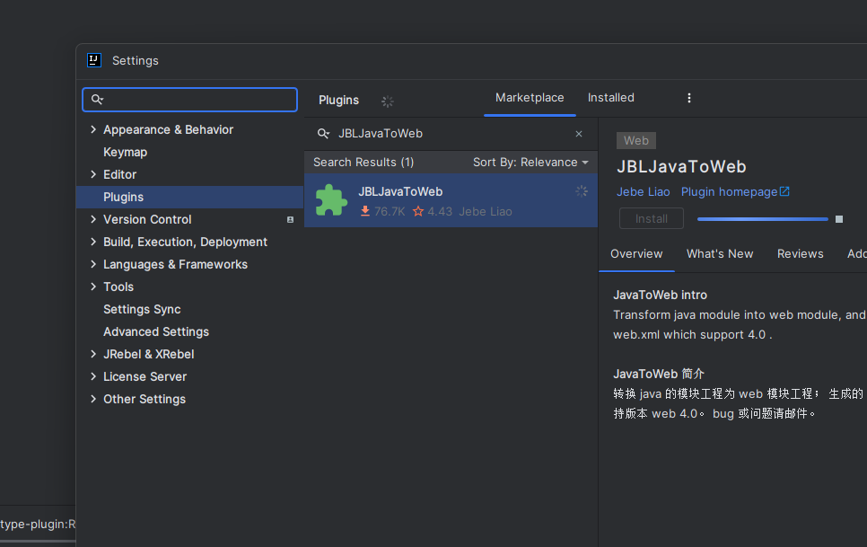

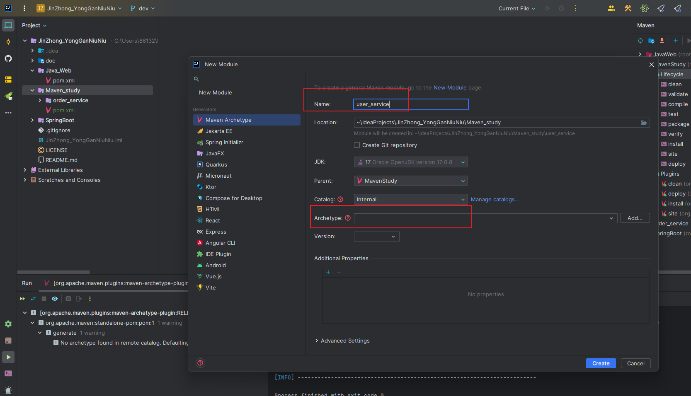

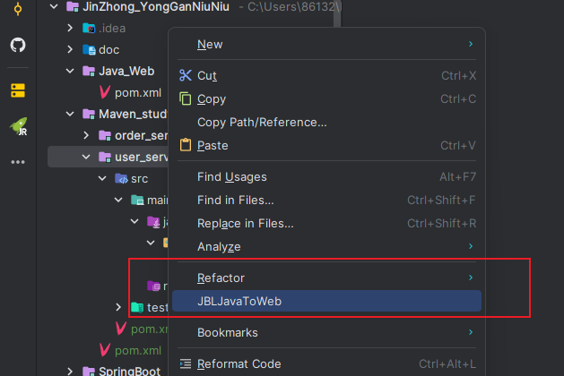

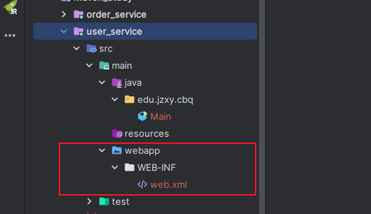

## 2.3 Maven 项目结构说明

Maven 是一个强大的构建工具，它提供一种标准化的项目结构，可以帮助开发者更容易地管理项目的依赖、构建、测试和发布等任务。以下是 Maven Web 程序的文件结构及每个文件的作用：

```xml
|-- pom.xml                               # Maven 项目管理文件 
|-- src
    |-- main                              # 项目主要代码
    |   |-- java                          # Java 源代码目录
    |   |   `-- com/example/myapp         # 开发者代码主目录
    |   |       |-- controller            # 存放 Controller 层代码的目录
    |   |       |-- service               # 存放 Service 层代码的目录
    |   |       |-- dao                   # 存放 DAO 层代码的目录
    |   |       `-- model                 # 存放数据模型的目录
    |   |-- resources                     # 资源目录，存放配置文件、静态资源等
    |   |   |-- log4j.properties          # 日志配置文件
    |   |   |-- spring-mybatis.xml        # Spring Mybatis 配置文件
    |   |   `-- static                    # 存放静态资源的目录
    |   |       |-- css                   # 存放 CSS 文件的目录
    |   |       |-- js                    # 存放 JavaScript 文件的目录
    |   |       `-- images                # 存放图片资源的目录
    |   `-- webapp                        # 存放 WEB 相关配置和资源
    |       |-- WEB-INF                   # 存放 WEB 应用配置文件
    |       |   |-- web.xml               # Web 应用的部署描述文件
    |       |   `-- classes               # 存放编译后的 class 文件
    |       `-- index.html                # Web 应用入口页面
    `-- test                              # 项目测试代码
        |-- java                          # 单元测试目录
        `-- resources                     # 测试资源目录
```

- pom.xml：Maven 项目管理文件，用于描述项目的依赖和构建配置等信息。
- src/main/java：存放项目的 Java 源代码。
- src/main/resources：存放项目的资源文件，如配置文件、静态资源等。
- src/main/webapp/WEB-INF：存放 Web 应用的配置文件。
- src/main/webapp/index.html：Web 应用的入口页面。
- src/test/java：存放项目的测试代码。
- src/test/resources：存放测试相关的资源文件，如测试配置文件等。

# 三、Maven 核心功能

## 3.1 依赖管理

Maven 依赖管理是 Maven 软件中最重要的功能之一。Maven 的依赖管理能够帮助开发人员自动解决软件包依赖问题，使得开发人员能够轻松地将其他开发人员开发的模块或第三方框架集成到自己的应用程序或模块中，避免出现版本冲突和依赖缺失等问题。

我们通过定义 POM 文件，Maven 能够自动解析项目的依赖关系，并通过 Maven **仓库自动**下载和管理依赖，从而避免了手动下载和管理依赖的繁琐工作和可能引发的版本冲突问题。

### 3.1.1 依赖的管理和添加

```xml
    <dependencies>
        <dependency>
            <groupId>junit</groupId>
            <artifactId>junit</artifactId>
            <version>3.8.1</version>
            <scope>test</scope>
        </dependency>
    </dependencies>
```

### 3.1.2 依赖版本提取和维护

```xml
    <properties>
        <junit.version>4.11</junit.version>
    </properties>
	<dependencies>
        <dependency>
            <groupId>junit</groupId>
            <artifactId>junit</artifactId>
            <version>${junit.version}</version>
            <scope>test</scope>
        </dependency>
    </dependencies>
```


## 3.2 依赖传递和依赖冲突

**依赖传递** 指的是当一个模块或库 A 依赖于另一个模块或库 B，而 B 又依赖于模块或库 C，那么 A 会间接依赖于 C。这种依赖传递结构可以形成一个依赖树。当我们引入一个库或框架时，构建工具（如 Maven、Gradle）会自动解析和加载其所有的直接和间接依赖，确保这些依赖都可用。

依赖传递的作用是：

1. 减少重复依赖：当多个项目依赖同一个库时，Maven 可以自动下载并且只下载一次该库。这样可以减少项目的构建时间和磁盘空间。
2. 自动管理依赖: Maven 可以自动管理依赖项，使用依赖传递，简化了依赖项的管理，使项目构建更加可靠和一致。
3. 确保依赖版本正确性：通过依赖传递的依赖，之间都不会存在版本兼容性问题，确实依赖的版本正确性！ 

我们通过 jackson 的例子来解释一下以来传递，我们可以去 [Maven Repository 官网](https://mvnrepository.com/) 查找我们想要的依赖信息：

项目中，需要导入 jackson 相关的依赖，通过之前导入经验，jackson 需要导入三个依赖，分别为：

-  Jackson Databind
-  Jackson Core
-  Jackson Annotations

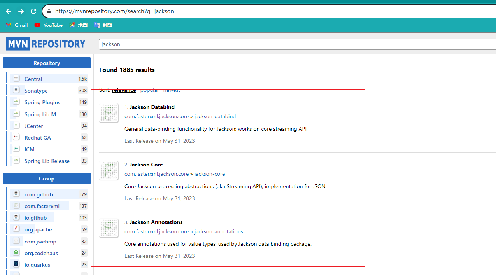

通过查看网站介绍的依赖传递特性：data-bind 中，依赖其他两个依赖

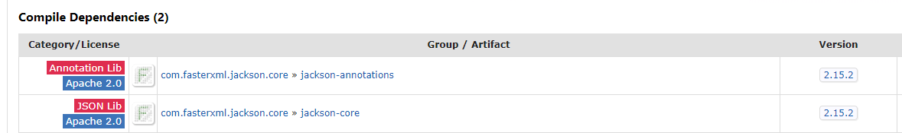

所以我们可以利用依赖的传递性直导入data-bind，自动依赖传递需要的依赖：

```xml
<!-- https://mvnrepository.com/artifact/com.fasterxml.jackson.core/jackson-databind -->
<dependency>
    <groupId>com.fasterxml.jackson.core</groupId>
    <artifactId>jackson-databind</artifactId>
    <version>2.15.0</version>
</dependency>
```

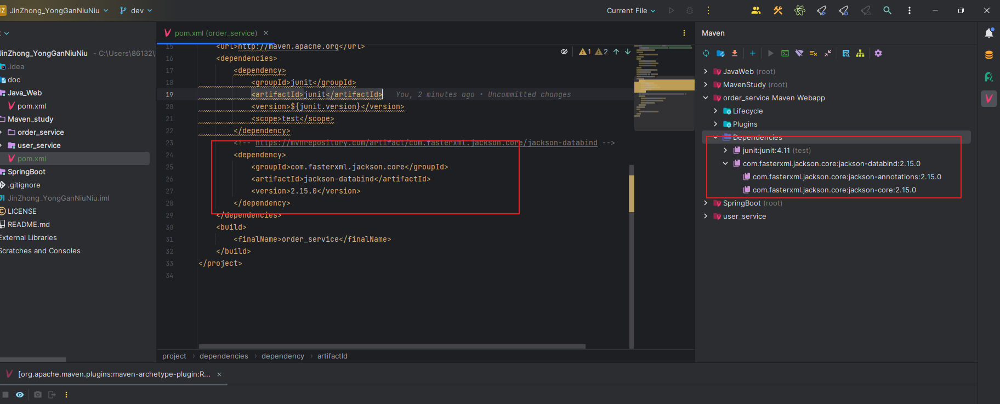

当直接引用或者间接引用出现了相同的 jar 包! 这时呢，一个项目就会出现相同的重复 jar 包，这就算作冲突！依赖冲突避免出现重复依赖，并且终止依赖传递！

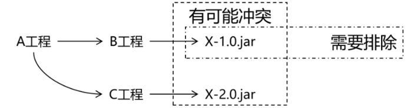

maven 自动解决依赖冲突问题能力，会按照自己的原则，进行重复依赖选择。同时也提供了手动解决的冲突的方式，不过不推荐！

解决依赖冲突（如何选择重复依赖）方式：
  1. 自动选择原则
      - 短路优先原则（第一原则）

          A—> B —> C —> D —> E —>X ( version 0.0.1)

          A—> F —> X ( version 0.0.2)

          则A依赖于X ( version 0.0.2)。
      - 依赖路径长度相同情况下，则“先声明优先”（第二原则）

          A—> E —> X ( version 0.0.1)

          A—> F —> X ( version 0.0.2)

          在 `<depencies></depencies>` 中，先声明的，路径相同，会优先选择！

## 3.3 扩展构建管理和插件配置

**构建概念:**

项目构建是指将源代码、依赖库和资源文件等转换成可执行或可部署的应用程序的过程，在这个过程中包括编译源代码、链接依赖库、打包和部署等多个步骤。

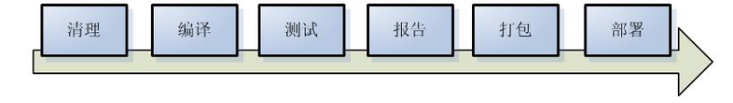

**主动触发场景：**

- 重新编译 : 编译不充分, 部分文件没有被编译!
- 打包 : 独立部署到外部服务器软件,打包部署
- 部署本地或者私服仓库 : maven工程加入到本地或者私服仓库,供其他工程使用

**命令方式构建:**

语法: mvn 构建命令  构建命令....

| 命令        | 描述                                        |
| ----------- | ------------------------------------------- |
| mvn clean   | 清理编译或打包后的项目结构,删除target文件夹 |
| mvn compile | 编译项目，生成target文件                    |
| mvn test    | 执行测试源码 (测试)                         |
| mvn site    | 生成一个项目依赖信息的展示页面              |
| mvn package | 打包项目，生成war / jar 文件                |
| mvn install | 打包后上传到maven本地仓库(本地部署)         |
| mvn deploy  | 只打包，上传到maven私服仓库(私服部署)       |

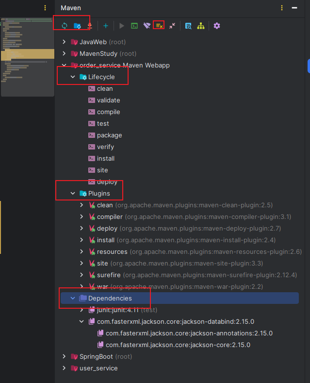


**构建命令周期:**

构建生命周期可以理解成是一组固定构建命令的有序集合，触发周期后的命令，会自动触发周期前的命令！也是一种简化构建的思路!

- 清理周期：主要是对项目编译生成文件进行清理

    包含命令：clean
- 默认周期：定义了真正构件时所需要执行的所有步骤，它是生命周期中最核心的部分

    包含命令：compile - test - package - install / deploy
- 报告周期

    包含命令：site

    打包: mvn clean package 本地仓库: mvn clean install

**最佳使用方案:**

```text
打包: mvn clean package
重新编译: mvn clean compile
本地部署: mvn clean install 
```

**周期，命令和插件:**

周期→包含若干命令→包含若干插件!

使用周期命令构建，简化构建过程！

最终进行构建的是插件！

插件配置:

```XML
<build>
   <!-- jdk 17 和 war包版本插件不匹配 -->
    <plugins>
        <plugin>
            <groupId>org.apache.maven.plugins</groupId>
            <artifactId>maven-war-plugin</artifactId>
            <version>3.2.2</version>
        </plugin>
    </plugins>
</build>
```

# 四、Maven 特性

## 4.1 Maven 工程继承关系

### 4.1.1 继承的概念

Maven 继承是指在 Maven 的项目中，让一个项目从另一个项目中继承配置信息的机制。继承可以让我们在多个项目中共享同一配置信息，简化项目的管理和维护工作。

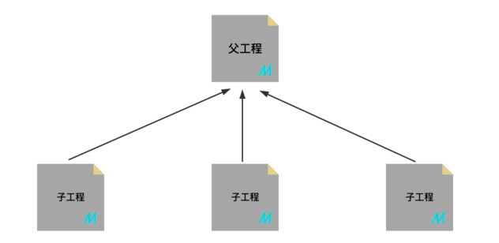

### 4.1.2 继承的作用

作用：在父工程中统一管理项目中的依赖信息,进行统一版本管理!

它的背景是：

- 对一个比较大型的项目进行了模块拆分。
- 一个 project 下面，创建了很多个 module。
- 每一个 module 都需要配置自己的依赖信息。

它背后的需求是：

- 多个模块要使用同一个框架，它们应该是同一个版本，所以整个项目中使用的框架版本需要统一管理。
- 使用框架时所需要的 jar 包组合（或者说依赖信息组合）需要经过长期摸索和反复调试，最终确定一个可用组合。这个耗费很大精力总结出来的方案不应该在新的项目中重新摸索。

通过在父工程中为整个项目维护依赖信息的组合既保证了整个项目使用规范、准确的 jar 包；又能够将以往的经验沉淀下来，节约时间和精力。

### 4.1.3 Demo

   父工程使用 dependencyManagement 标签配置对依赖统一管理  ,被管理的依赖并没有真正被引入到工程 

- 父工程

```xml
        <packaging>pom</packaging>
		<dependencyManagement>
        <dependencies>
            <dependency>
                <groupId>org.springframework</groupId>
                <artifactId>spring-core</artifactId>
                <version>4.0.0.RELEASE</version>
            </dependency>
            <dependency>
                <groupId>org.springframework</groupId>
                <artifactId>spring-beans</artifactId>
                <version>4.0.0.RELEASE</version>
            </dependency>
            <dependency>
                <groupId>org.springframework</groupId>
                <artifactId>spring-context</artifactId>
                <version>4.0.0.RELEASE</version>
            </dependency>
            <dependency>
                <groupId>org.springframework</groupId>
                <artifactId>spring-expression</artifactId>
                <version>4.0.0.RELEASE</version>
            </dependency>
            <dependency>
                <groupId>org.springframework</groupId>
                <artifactId>spring-aop</artifactId>
                <version>4.0.0.RELEASE</version>
            </dependency>
        </dependencies>
    </dependencyManagement>
```

- 子工程

子工程引用父工程中的依赖信息时，可以把版本号去掉。把版本号去掉就表示子工程中这个依赖的版本由父工程决定。  具体来说是由父工程的dependencyManagement来决定。 

```xml
    <dependencies>
        <dependency>
            <groupId>org.springframework</groupId>
            <artifactId>spring-core</artifactId>
        </dependency>
        <dependency>
            <groupId>org.springframework</groupId>
            <artifactId>spring-beans</artifactId>
        </dependency>
        <dependency>
            <groupId>org.springframework</groupId>
            <artifactId>spring-context</artifactId>
        </dependency>
        <dependency>
            <groupId>org.springframework</groupId>
            <artifactId>spring-expression</artifactId>
        </dependency>
        <dependency>
            <groupId>org.springframework</groupId>
            <artifactId>spring-aop</artifactId>
        </dependency>
    </dependencies>
```

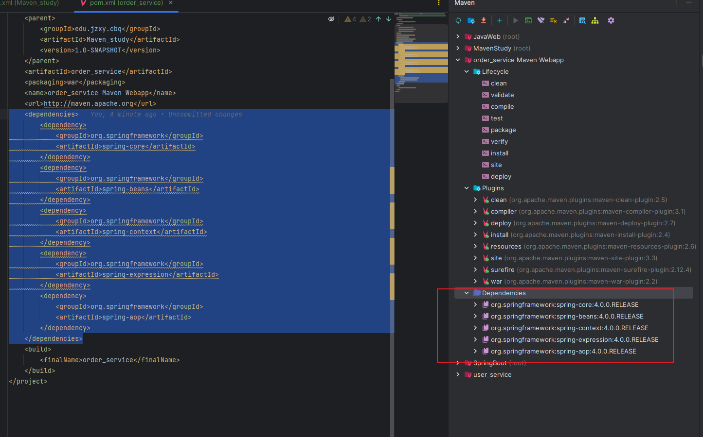

## 4.2 Maven 工程聚合关系

### 4.2.1 聚合的概念

Maven 聚合是指将多个项目组织到一个父级项目中，通过触发父工程的构建,统一按顺序触发子工程构建的过程!!

### 4.2.2 聚合的作用

1. 统一管理子项目构建：通过聚合，可以将多个子项目组织在一起，方便管理和维护。
2. 优化构建顺序：通过聚合，可以对多个项目进行顺序控制，避免出现构建依赖混乱导致构建失败的情况。

```xml
    <groupId>edu.jzxy.cbq</groupId>
    <artifactId>Maven_study</artifactId>
    <version>1.0-SNAPSHOT</version>
    <packaging>pom</packaging>
    <description>Manage dependencies</description>
    <modules>
        <module>order_service</module>
        <module>user_service</module>
    </modules>
```

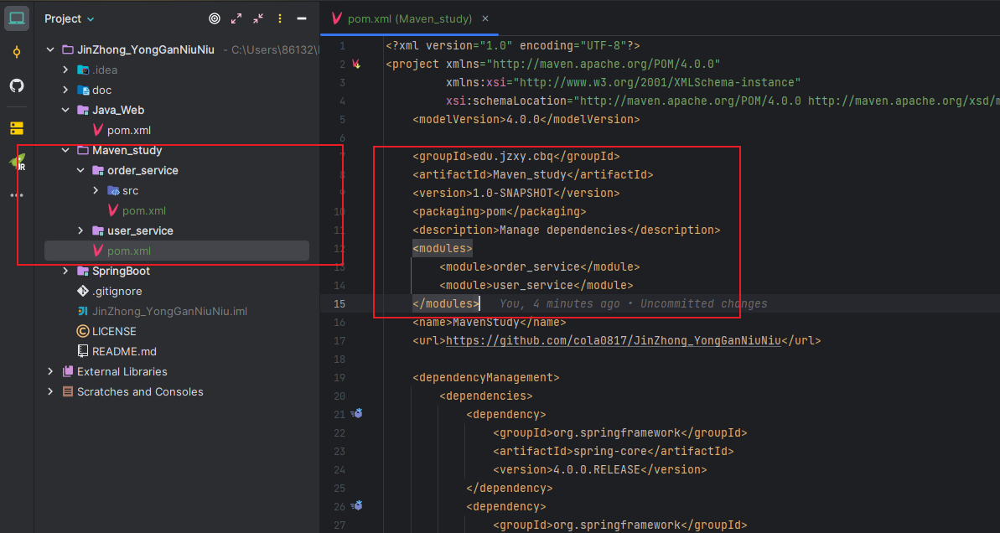

添加打包插件

```xml
    <build>
        <!-- jdk 17 和 war 包版本插件不匹配 -->
        <plugins>
            <plugin>
                <groupId>org.apache.maven.plugins</groupId>
                <artifactId>maven-war-plugin</artifactId>
                <version>3.2.2</version>
            </plugin>
        </plugins>
    </build>
```


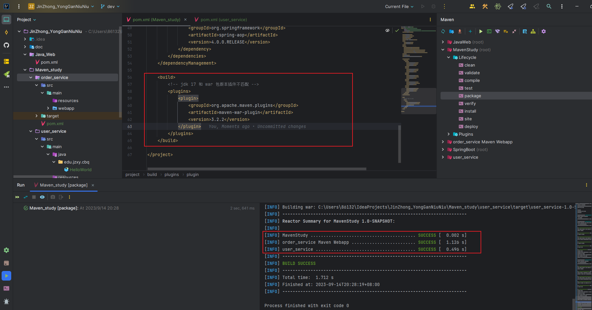

# 五、MavenQuickStart

## 5.1 流程分析

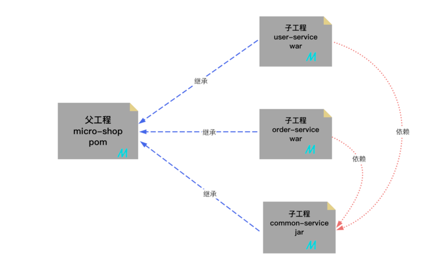

需求案例：搭建一个电商平台项目，该平台包括用户服务、订单服务、通用工具模块等。

项目架构：

1. 用户服务：负责处理用户相关的逻辑，例如用户信息的管理、用户注册、登录等。
2. 订单服务：负责处理订单相关的逻辑，例如订单的创建、订单支付、退货、订单查看等。
3. 通用模块：负责存储其他服务需要通用工具类，其他服务依赖此模块。

服务依赖：

1. 用户服务 
    - spring-aop
2. 订单服务 
    - spring-context 
    - spring-core 
    - spring-beans 
    - spring-expressopn
3. 通用模块 
    - spring-core

## 5.2 项目搭建

### 5.2.1 父项目搭建

```xml
<?xml version="1.0" encoding="UTF-8"?>
<project xmlns="http://maven.apache.org/POM/4.0.0"
         xmlns:xsi="http://www.w3.org/2001/XMLSchema-instance"
         xsi:schemaLocation="http://maven.apache.org/POM/4.0.0 http://maven.apache.org/xsd/maven-4.0.0.xsd">
    <modelVersion>4.0.0</modelVersion>

    <groupId>edu.jzxy.cbq</groupId>
    <artifactId>Maven_study</artifactId>
    <version>1.0-SNAPSHOT</version>
    <packaging>pom</packaging>
    <description>Manage dependencies</description>
    <modules>
        <module>order_service</module>
        <module>user_service</module>
        <module>common_service</module>
    </modules>
    <properties>
        <maven.compiler.source>17</maven.compiler.source>
        <maven.compiler.target>17</maven.compiler.target>
        <maven.compiler.compilerVersion>17</maven.compiler.compilerVersion>
        <project.build.sourceEncoding>UTF-8</project.build.sourceEncoding>
        <project.reporting.outputEncoding>UTF-8</project.reporting.outputEncoding>
        <spring.version>4.0.0.RELEASE</spring.version>
    </properties>
    <name>MavenStudy</name>
    <url>https://github.com/cola0817/JinZhong_YongGanNiuNiu</url>

    <dependencyManagement>
        <dependencies>
            <dependency>
                <groupId>org.springframework</groupId>
                <artifactId>spring-core</artifactId>
                <version>${spring.version}</version>
            </dependency>
            <dependency>
                <groupId>org.springframework</groupId>
                <artifactId>spring-beans</artifactId>
                <version>${spring.version}</version>
            </dependency>
            <dependency>
                <groupId>org.springframework</groupId>
                <artifactId>spring-context</artifactId>
                <version>${spring.version}</version>
            </dependency>
            <dependency>
                <groupId>org.springframework</groupId>
                <artifactId>spring-expression</artifactId>
                <version>${spring.version}</version>
            </dependency>
            <dependency>
                <groupId>org.springframework</groupId>
                <artifactId>spring-aop</artifactId>
                <version>${spring.version}</version>
            </dependency>
        </dependencies>
    </dependencyManagement>

    <build>
        <!-- jdk 17 和 war 包版本插件不匹配 -->
        <plugins>
            <plugin>
                <groupId>org.apache.maven.plugins</groupId>
                <artifactId>maven-war-plugin</artifactId>
                <version>3.2.2</version>
            </plugin>
        </plugins>
    </build>

</project>
```


### 5.2.2 子项目搭建

- common_service

```xml
<?xml version="1.0" encoding="UTF-8"?>
<project xmlns="http://maven.apache.org/POM/4.0.0"
         xmlns:xsi="http://www.w3.org/2001/XMLSchema-instance"
         xsi:schemaLocation="http://maven.apache.org/POM/4.0.0 http://maven.apache.org/xsd/maven-4.0.0.xsd">
    <modelVersion>4.0.0</modelVersion>
    <parent>
        <groupId>edu.jzxy.cbq</groupId>
        <artifactId>Maven_study</artifactId>
        <version>1.0-SNAPSHOT</version>
    </parent>

    <artifactId>common_service</artifactId>

    <dependencies>
        <dependency>
            <groupId>org.springframework</groupId>
            <artifactId>spring-core</artifactId>
        </dependency>
    </dependencies>


</project>
```

- user-service

```xml
<?xml version="1.0" encoding="UTF-8"?>

<project xmlns="http://maven.apache.org/POM/4.0.0" xmlns:xsi="http://www.w3.org/2001/XMLSchema-instance" xsi:schemaLocation="http://maven.apache.org/POM/4.0.0 http://maven.apache.org/xsd/maven-4.0.0.xsd">  
  <modelVersion>4.0.0</modelVersion>  
  <parent> 
    <groupId>edu.jzxy.cbq</groupId>  
    <artifactId>Maven_study</artifactId>  
    <version>1.0-SNAPSHOT</version> 
  </parent>  
  <artifactId>user_service</artifactId>
  <packaging>war</packaging>
  <dependencies>
    <dependency>
      <groupId>org.springframework</groupId>
      <artifactId>spring-aop</artifactId>
    </dependency>
  </dependencies>
</project>

```

- order_service

```xml
<?xml version="1.0" encoding="UTF-8"?>

<project xmlns="http://maven.apache.org/POM/4.0.0" xmlns:xsi="http://www.w3.org/2001/XMLSchema-instance" xsi:schemaLocation="http://maven.apache.org/POM/4.0.0 http://maven.apache.org/maven-v4_0_0.xsd">  
  <modelVersion>4.0.0</modelVersion>  
  <properties> 
    <junit.version>4.11</junit.version> 
  </properties>  
  <parent> 
    <groupId>edu.jzxy.cbq</groupId>  
    <artifactId>Maven_study</artifactId>  
    <version>1.0-SNAPSHOT</version> 
  </parent>  
  <artifactId>order_service</artifactId>  
  <packaging>war</packaging>  
  <name>order_service</name>
  <url>http://maven.apache.org</url>  
  <dependencies> 
    <dependency> 
      <groupId>org.springframework</groupId>  
      <artifactId>spring-core</artifactId> 
    </dependency>  
    <dependency> 
      <groupId>org.springframework</groupId>  
      <artifactId>spring-beans</artifactId> 
    </dependency>  
    <dependency> 
      <groupId>org.springframework</groupId>  
      <artifactId>spring-context</artifactId> 
    </dependency>  
    <dependency> 
      <groupId>org.springframework</groupId>  
      <artifactId>spring-expression</artifactId> 
    </dependency>
  </dependencies>  
  <build> 
    <finalName>order_service</finalName> 
  </build> 
</project>

```


### 5.2.3 构建


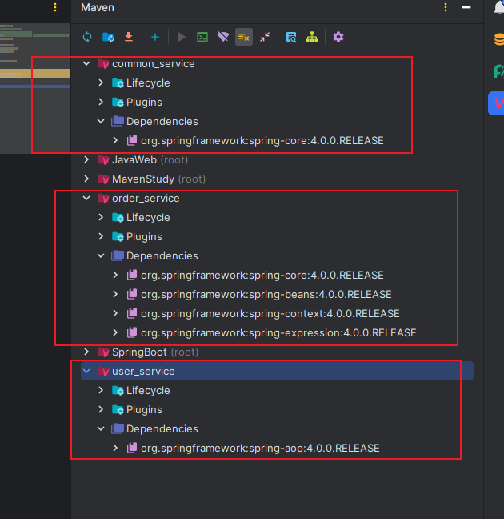


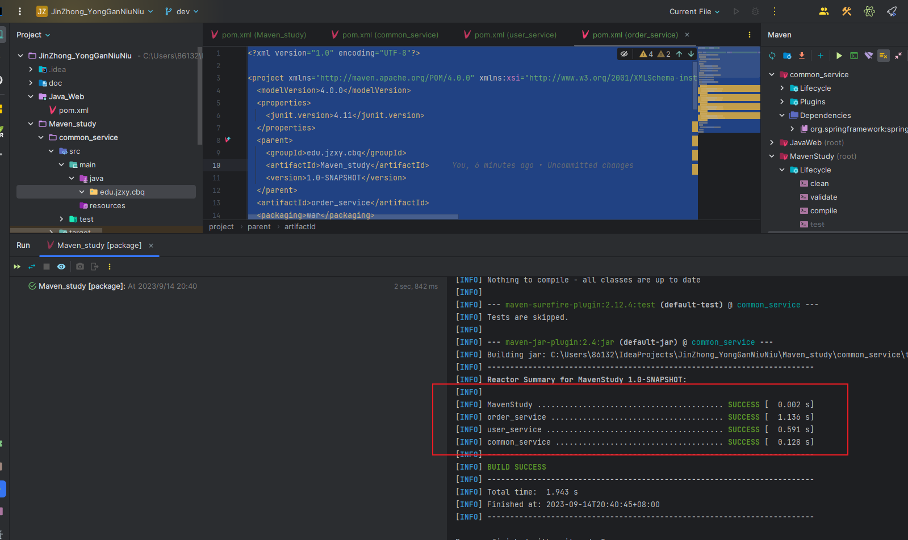