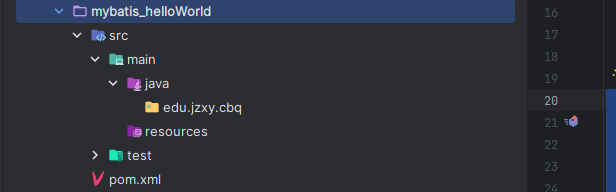
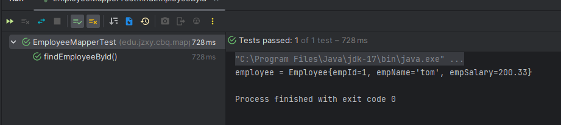

# MyBatis 入门

# 一、MyBatis 简介

## 1.1 MyBatis 概述

[MyBatis](https://mybatis.org/mybatis-3/zh/index.html) 最初是 Apache 的一个开源项目 iBatis, 2010年6月这个项目由 Apache Software Foundation 迁移到了 Google Code。随着开发团队转投 Google Code 旗下， iBatis3.x 正式更名为MyBatis。代码于 2013 年 11 月迁移到 Github。

MyBatis 是一款优秀的持久层框架，它支持自定义 SQL、存储过程以及高级映射。MyBatis 免除了几乎所有的 JDBC 代码以及设置参数和获取结果集的工作。MyBatis 可以通过简单的 XML 或注解来配置和映射原始类型、接口和 Java POJO（Plain Old Java Objects，普通老式 Java 对象）为数据库中的记录。


## 1.2 MyBatis 与持久层框架对比

- JDBC

  - SQL 夹杂在Java代码中耦合度高，导致硬编码内伤

  - 维护不易且实际开发需求中 SQL 有变化，频繁修改的情况多见

  - 代码冗长，开发效率低

- HiberNate 和 JPA

  - 操作简便，开发效率高

  - 程序中的长难复杂 SQL 需要绕过框架

  - 内部自动生成的 SQL，不容易做特殊优化

  - 基于全映射的全自动框架，大量字段的 POJO 进行部分映射时比较困难。

  - 反射操作太多，导致数据库性能下降

- MyBatis

  - 轻量级，性能出色

  - SQL 和 Java 编码分开，功能边界清晰。Java代码专注业务、SQL语句专注数据

  - 开发效率稍逊于 Hibernate，但是完全能够接收

开发效率：Hibernate > Mybatis > JDBC

运行效率：JDBC > Mybatis > Hibernate

## 1.3 MyBatis QuickStart

### 1.3.1 准备数据模型

```sql
CREATE DATABASE `mybatis-example`;

USE `mybatis-example`;

CREATE TABLE `t_emp`(
  emp_id INT AUTO_INCREMENT,
  emp_name CHAR(100),
  emp_salary DOUBLE(10,5),
  PRIMARY KEY(emp_id)
);

INSERT INTO `t_emp`(emp_name,emp_salary) VALUES("tom",200.33);
INSERT INTO `t_emp`(emp_name,emp_salary) VALUES("jerry",666.66);
INSERT INTO `t_emp`(emp_name,emp_salary) VALUES("andy",777.77);
```


### 1.3.2 项目搭建

- 创建项目



- 引入依赖

```xml
    <dependencies>
        <dependency>
            <groupId>org.mybatis</groupId>
            <artifactId>mybatis</artifactId>
        </dependency>

        <!-- MySQL 驱动 mybatis 底层依赖 jdbc 驱动实现,本次不需要导入连接池,mybatis自 带! -->
        <dependency>
            <groupId>mysql</groupId>
            <artifactId>mysql-connector-java</artifactId>
        </dependency>

        <!--junit5 测试-->
        <dependency>
            <groupId>org.junit.jupiter</groupId>
            <artifactId>junit-jupiter-api</artifactId>
        </dependency>
    </dependencies>
```

### 1.3.3 代码编写

- 实体类

```java
public class Employee {

    private Integer empId;

    private String empName;

    private Double empSalary;
    
    //getter | setter
}
```

- Mapper 接口以及 MapperXML 文件

MyBatis 框架下，SQL 语句编写位置发生改变，从原来的 Java 类，改成 **XML** 或者注解定义！

推荐在 XML 文件中编写 SQL 语句，让用户能更专注于 SQL 代码，不用关注其他的 JDBC 代码。

如果拿它跟具有相同功能的 JDBC 代码进行对比，你会立即发现省掉了将近 95% 的代码！！

一般编写 SQL 语句的文件命名：XxxMapper.xml  Xxx一般取表名！！

Mybatis 中的 Mapper 接口相当于以前的 Dao。但是区别在于，Mapper 仅仅只是建接口即可，我们不需要提供实现类，具体的 SQL 写到对应的 Mapper 文件，该用法的思路如下图所示：


1. 定义 mapper 接口

位置：`edu.jzxy.cbq.mapper.EmployeeMapper`

```java
public interface EmployeeMapper {

    /**
     * 根据员工id查询员工数据方法
     * @param empId  员工id
     * @return 员工实体对象
     */
    Employee selectEmployee(Integer empId);
}
```

2. 定义 MapperXML 文件

位置：`resources/edu/jzxy/cbq/mapper/EmployeeMapper.xml` 与 mapper 所在包名保持一致，以保证打包后可以位于同一目录级别下。

注意：

- 需要使用 `/` 分割而非 `.`


```xml
<?xml version="1.0" encoding="UTF-8" ?>
<!DOCTYPE mapper
    PUBLIC "-//mybatis.org//DTD Mapper 3.0//EN"
    "https://mybatis.org/dtd/mybatis-3-mapper.dtd">
<!-- namespace 等于 mapper 接口类的全限定名,这样实现对应 -->
<mapper namespace="edu.jzxy.cbq.mapper.EmployeeMapper">

    <!-- 查询使用 select 标签
            id = 方法名
            resultType = 返回值类型
            标签内编写 SQL 语句
     -->
    <select id="findEmployeeById" resultType="edu.jzxy.cbq.entity.Employee">
        <!-- #{empId} 代表动态传入的参数,并且进行赋值 -->
        select emp_id empId,emp_name empName, emp_salary empSalary from
        t_emp where emp_id = #{empId}
    </select>
</mapper>
```

注意：

- 方法名和 SQL 的 id 一致
- 方法返回值和 result Type 一致
- 方法的参数和 SQL 的参数一致
- 接口的全类名和映射配置文件的名称空间一致

> 打包后位于同一目录级别


- 准备 MyBatis 配置文件

mybatis 框架配置文件： 数据库连接信息，性能配置，mapper.xml 配置等！

习惯上命名为 mybatis-config.xml，这个文件名仅仅只是建议，并非强制要求。将来整合 Spring 之后，这个配置文件可以省略.

```xml
<?xml version="1.0" encoding="UTF-8" ?>
<!DOCTYPE configuration
    PUBLIC "-//mybatis.org//DTD Config 3.0//EN"
    "http://mybatis.org/dtd/mybatis-3-config.dtd">
<configuration>

    <!-- environments 表示配置 Mybatis 的开发环境，可以配置多个环境，在众多具体环境中，
    使用 default 属性指定实际运行时使用的环境。default 属性的取值是 environment 标签的 id 属性的值。 -->
    <environments default="development">
        <!-- environment 表示配置 Mybatis 的一个具体的环境 -->
        <environment id="development">
            <!-- Mybatis 的内置的事务管理器 -->
            <transactionManager type="JDBC"/>
            <!-- 配置数据源 -->
            <dataSource type="POOLED">
                <!-- 建立数据库连接的具体信息 -->
                <property name="driver" value="com.mysql.cj.jdbc.Driver"/>
                <property name="url" value="jdbc:mysql://localhost:3306/mybatis-example"/>
                <property name="username" value="root"/>
                <property name="password" value="root"/>
            </dataSource>
        </environment>
    </environments>

    <mappers>
        <!-- Mapper 注册：指定 Mybatis 映射文件的具体位置 -->
        <!-- mapper 标签：配置一个具体的 Mapper 映射文件 -->
        <!-- resource 属性：指定 Mapper 映射文件的实际存储位置，这里需要使用一个以类路径根目录为基准的相对路径 -->
        <!-- 对 Maven 工程的目录结构来说，resources 目录下的内容会直接放入类路径，所以这里我们可以以 resources 目录为基准 -->
        <mapper resource="edu/jzxy/cbq/mapper/EmployeeMapper.xml"/>
    </mappers>

</configuration>

```


### 1.3.4 测试

```java
package edu.jzxy.cbq.mapper;

import edu.jzxy.cbq.entity.Employee;
import org.apache.ibatis.io.Resources;
import org.apache.ibatis.session.SqlSession;
import org.apache.ibatis.session.SqlSessionFactory;
import org.apache.ibatis.session.SqlSessionFactoryBuilder;
import org.junit.jupiter.api.Test;

import java.io.IOException;
import java.io.InputStream;


class EmployeeMapperTest {

    @Test
    void findEmployeeById() throws IOException {
  
        /*创建 SqlSessionFactory 对象并声明 Mybatis 全局配置文件的路径*/
        String mybatisConfigFilePath = "mybatis-config.xml";

        /*以输入流的形式加载 Mybatis 配置文件*/
        InputStream inputStream = Resources.getResourceAsStream(mybatisConfigFilePath);

        /*基于读取 Mybatis 配置文件的输入流创建 SqlSessionFactory 对象*/
        SqlSessionFactory sessionFactory = new SqlSessionFactoryBuilder().build(inputStream);

        /*使用 SqlSessionFactory 对象开启一个会话*/
        SqlSession session = sessionFactory.openSession();

        /*根据 EmployeeMapper 接口的 Class 对象获取 Mapper 接口类型的对象(动态代理技术)*/
        EmployeeMapper employeeMapper = session.getMapper(EmployeeMapper.class);

        /*调用代理类方法既可以触发对应的 SQL 语句*/
        Employee employee = employeeMapper.findEmployeeById(1);

        System.out.println("employee = " + employee);

        /* 关闭 SqlSession
        *  提交事务 [DQL 不需要,其他需要]
        *  关闭会话
        * */
        session.commit(); 
        session.close(); 
    }
}

```



### 1.3.5 概括

- SqlSession：代表 Java 程序和数据库之间的会话。（HttpSession 是 Java 程序和浏览器之间的会话）
- SqlSessionFactory：是“生产” SqlSession 的“工厂”。
- 工厂模式：如果创建某一个对象，使用的过程基本固定，那么我们就可以把创建这个对象的相关代码封装到一个“工厂类”中，以后都使用这个工厂类来“生产”我们需要的对象。

#### 1.3.5.1 SqlSession 和 HttpSession 区别

- HttpSession：工作在 Web 服务器上，属于表述层。
    - 代表浏览器和 Web 服务器之间的会话。
- SqlSession：不依赖 Web 服务器，属于持久化层。
    - 代表 Java 程序和数据库之间的会话。

#### 1.3.5.2 大体流程


# 二、MyBatis 基本使用

## 2.1 SQL 语句传参

使用 MyBatis 对 SQL 语句传参有两种方式：

- 以 #{} 的方式传参
- 以 ${} 的方式传参


### 2.1.1 MyBatis 日志输出配置

mybatis 配置文件设计标签和顶层结构如下：

- configuration（配置）
    - [properties（属性）](https://mybatis.org/mybatis-3/zh/configuration.html#properties)
    - [settings（设置）](https://mybatis.org/mybatis-3/zh/configuration.html#settings)
    - [typeAliases（类型别名）](https://mybatis.org/mybatis-3/zh/configuration.html#typeAliases)
    - [typeHandlers（类型处理器）](https://mybatis.org/mybatis-3/zh/configuration.html#typeHandlers)
    - [objectFactory（对象工厂）](https://mybatis.org/mybatis-3/zh/configuration.html#objectFactory)
    - [plugins（插件）](https://mybatis.org/mybatis-3/zh/configuration.html#plugins)
    - [environments（环境配置）](https://mybatis.org/mybatis-3/zh/configuration.html#environments)
        - environment（环境变量）
            - transactionManager（事务管理器）
            - dataSource（数据源）
    - [databaseIdProvider（数据库厂商标识）](https://mybatis.org/mybatis-3/zh/configuration.html#databaseIdProvider)
    - [mappers（映射器）](https://mybatis.org/mybatis-3/zh/configuration.html#mappers)

我们可以在 mybatis 的配置文件使用 settings 标签设置，输出运过程 SQL 日志

通过查看日志，我们可以判定 #{} 和 ${} 的输出效果


```xml
    <settings>
        <!-- 日志输出实现 选择 STDOUT_LOGGING 输出 -->
        <setting name="logImpl" value="STDOUT_LOGGING"/>
    </settings>
```

### 2.1.2 以 #{} 的方式传参

Mybatis 会将 SQL 语句中的 #{} 转换为问号占位符。


### 2.1.3 以 ${} 的方式传参

${} 形式传参， Mybatis 底层做的是字符串拼接操作。


通常不会采用 ${} 的方式传值。一个特定的适用场景是：通过 Java 程序动态生成数据库表，表名部分需要 Java 程序通过参数传入；而 JDBC 对于表名部分是不能使用问号占位符的，此时只能使用

结论：实际开发中，能用 #{} 实现的，肯定不用 ${}。

特殊情况： 动态的不是值，是列名或者关键字，需要使用 ${} 拼接

```java
//注解方式传入参数
@Select("select * from user where ${column} = #{value}")
User findByColumn(@Param("column") String column, 
                                @Param("value") String value);
```


## 2.2 数据的输入

### 2.2.1 MyBatis 总体机制概括


### 2.2.2 概念说明

这里数据输入具体是指上层方法（例如 Service 方法）调用 Mapper 接口时，数据传入的形式。

- 简单类型：只包含一个值的数据类型
    - 基本数据类型：int、byte、short、double
    - 基本数据类型的包装类型：Integer、Character、Double
    - 字符串类型：String
- 复杂类型：包含多个值的数据类型
    - 实体类类型：Employee、Department
    - 集合类型：List、Set、Map
    - 数组类型：int[]、String[]
    - 复合类型：`List<Employee>`、实体类中包含集合

### 2.2.3 单个简单类型参数

- Mapper 接口中抽象方法的声明

```java
Employee findEmployeeById(Integer empId);
```

- SQL 语句

```xml
    <select id="findEmployeeById" resultType="edu.jzxy.cbq.entity.Employee">
        <!-- #{empId} 代表动态传入的参数,并且进行赋值 -->
        select emp_id empId,emp_name empName, emp_salary empSalary from
        t_emp where emp_id = #{empId}
    </select>
```

单个简单类型参数，在 #{} 中可以随意命名，但是没有必要。通常还是使用和接口方法参数同名。

### 2.2.4 实体类类型参数

- Mapper 接口中抽象方法的声明

```java
    /**
     * 插入员工
     * @param employee employee
     * @return count
     */
    int insertEmployee(Employee employee);
```

- SQL 语句

```xml
<insert id="insertEmployee">
  insert into t_emp(emp_name,emp_salary) values(#{empName},#{empSalary})
</insert>
```

- 对应关系


Mybatis 会根据 #{} 中传入的数据，加工成 getXxx() 方法，通过反射在实体类对象中调用这个方法，从而获取到对应的数据。填充到 #{} 解析后的问号占位符这个位置。

### 2.2.5 零散的简单类型数据

零散的多个简单类型参数，如果没有特殊处理，那么 Mybatis 无法识别自定义名称：


- Mapper 接口中抽象方法的声明

```java
    /**
     * 更新员工信息
     * @param empId empId
     * @param empSalary empSalary
     * @return count
     */
    int updateEmployee(@Param("empId") Integer empId, @Param("empSalary") Double empSalary);
```

- SQL 语句

```xml
    <update id="updateEmployee">
        update t_emp set emp_salary=#{empSalary} where emp_id=#{empId}
    </update>
```

- 对应关系


### 2.2.6 Map 类型参数

- Mapper 接口中抽象方法的声明

```java
    /**
     * 通过 map 传参修改员工信息
     * @param paramMap paramMap
     * @return count
     */
    int updateEmployeeByMap(Map<String, Object> paramMap);
```

- SQL 语句

```xml
    <update id="updateEmployeeByMap">
        update t_emp set emp_salary=#{empSalary} where emp_id=#{empId}
    </update>
```

- junit 测试

```java
    @Test
    void updateEmployeeByMap() {
        EmployeeMapper employeeMapper = session.getMapper(EmployeeMapper.class);
        Map<String, Object> paramMap = new HashMap<>();

        paramMap.put("empSalary", 999.99);
        paramMap.put("empId", 4);

        int count = employeeMapper.updateEmployeeByMap(paramMap);

        System.out.println(count);
    }
```


- 对应关系

#{} 中写 Map 中的 key

- 使用场景

有很多零散的参数需要传递，但是没有对应的实体类类型可以使用。使用 @Param 注解一个一个传入又太麻烦了。所以都封装到 Map 中。

## 2.3 数据的输出

### 2.3.1 输出概述

数据输出总体上有两种形式：

- 增删改操作返回的受影响行数：直接使用 int 或 long 类型接收即可
- 查询操作的查询结果

我们需要做的是，指定查询的输出数据类型即可！

并且插入场景下，实现主键数据回显示！

### 2.3.2 单个简单类型

- Mapper 接口中抽象方法的声明

```java
    /**
     * 查询记录
     * @return counts
     */
    int selectEmpCount();
```

- SQL 语句

```xml
    <select id="selectEmpCount" resultType="int">
        select count(*) from t_emp
    </select>
```

Mybatis 内部给常用的数据类型设定了很多别名。 以 int 类型为例，可以写的名称有：int、integer、Integer、java.lang.Integer、Int、INT、INTEGER 等等。

- junit 测试

```java
    @Test
    void selectEmpCount() {
        EmployeeMapper employeeMapper = session.getMapper(EmployeeMapper.class);

        int count = employeeMapper.selectEmpCount();

        System.out.println(count);
    }
```

细节解释：

  select 标签，通过 resultType 指定查询返回值类型！

  resultType = "全限定符 ｜ 别名 ｜ 如果是返回集合类型，写范型类型即可"

别名问题：

类型别名可为 Java 类型设置一个缩写名字。 它仅用于 XML 配置，意在降低冗余的全限定类名书写。例如：

```xml
<typeAliases>
  <typeAlias alias="Author" type="domain.blog.Author"/>
  <typeAlias alias="Blog" type="domain.blog.Blog"/>
</typeAliases>
```

当这样配置时，Blog 可以用在任何使用 domain.blog.Blog 的地方。

也可以指定一个包名，MyBatis 会在包名下面搜索需要的 Java Bean，比如：

```xml
<typeAliases> <package name="domain.blog"/> </typeAliases>
```

每一个在包 domain.blog 中的 Java Bean，在没有注解的情况下，会使用 Bean 的首字母小写的非限定类名来作为它的别名。 比如 domain.blog.Author 的别名为 author；若有注解，则别名为其注解值。见下面的例子：

```java
@Alias("author")
public class Author {
    ...
}
```

下面是 Mybatis 为常见的 Java 类型内建的类型别名。它们都是不区分大小写的，注意，为了应对原始类型的命名重复，采取了特殊的命名风格。


### 2.3.3 返回实体类型对象

- Mapper 接口中抽象方法的声明

```java
    /**
     * 根据员工 id 查询员工数据方法
     * @param empId  员工 id
     * @return 员工实体对象
     */
    Employee findEmployeeById(Integer empId);
```

- SQL 语句

```xml
    <select id="findEmployeeById" resultType="edu.jzxy.cbq.entity.Employee">
        <!-- #{empId} 代表动态传入的参数,并且进行赋值 -->
        select emp_id empId,emp_name empName, emp_salary empSalary from
        t_emp where emp_id = #{empId}
    </select>
```

通过给数据库表字段加别名，让查询结果的每一列都和 Java 实体类中属性对应起来。

增加全局配置自动识别对应关系

在 Mybatis 全局配置文件中，做了下面的配置，select 语句中可以不给字段设置别名

```xml
<!-- 在全局范围内对 Mybatis 进行配置 -->
<settings>

  <!-- 具体配置 -->
  <!-- 从 org.apache.ibatis.session.Configuration 类中可以查看能使用的配置项 -->
  <!-- 将 mapUnderscoreToCamelCase 属性配置为 true，表示开启自动映射驼峰式命名规则 -->
  <!-- 规则要求数据库表字段命名方式：单词_单词 -->
  <!-- 规则要求 Java 实体类属性名命名方式：首字母小写的驼峰式命名 -->
  <setting name="mapUnderscoreToCamelCase" value="true"/>

</settings>
```

### 2.3.4 返回 Map 类型

适用 于SQL 查询返回的各个字段综合起来并不和任何一个现有的实体类对应，没法封装到实体类对象中。能够封装成实体类类型的，就不使用 Map 类型。

- Mapper 接口中抽象方法的声明


- SQL 语句


- junit 测试


- 对应关系


- 使用场景

### 2.3.5 返回 List 类型

查询结果返回多个实体类对象，希望把多个实体类对象放在 List 集合中返回。此时不需要任何特殊处理，在resultType 属性中还是设置实体类类型即可。

- Mapper 接口中抽象方法的声明

```java
    /**
     * 查找全部员工
     * @return employee list
     */
    List<Employee> findAllEmployee();
```


- SQL 语句

```xml
    <select id="findAllEmployee" resultType="edu.jzxy.cbq.entity.Employee">
        select emp_id empId,emp_name empName,emp_salary empSalary
        from t_emp
    </select>
```

- junit 测试

```java
    @Test
    void findAllEmployee() {
        EmployeeMapper employeeMapper = session.getMapper(EmployeeMapper.class);
        List<Employee> employeeList = employeeMapper.findAllEmployee();

        employeeList.forEach(System.out::println);
    }
```

### 2.3.6 返回主键值

#### 2.3.6.1 自增长类型主键

- Mapper 接口中抽象方法的声明

```java
    /**
     * 插入员工 (自增长类型主键)
     * @param employee employee
     * @return 主键
     */
    int insertEmployeeV2(Employee employee);
```

- SQL 语句

```xml
    <insert id="insertEmployeeV2" useGeneratedKeys="true" keyProperty="empId">
        insert into t_emp(emp_name,emp_salary) values(#{empName},#{empSalary})
    </insert>
```

- junit 测试

```java
    @Test
    void insertEmployeeV2() {
        EmployeeMapper employeeMapper = session.getMapper(EmployeeMapper.class);
        Employee employee = new Employee();

        employee.setEmpName("RH");
        employee.setEmpSalary(3.0);

        int key = employeeMapper.insertEmployeeV2(employee);

        System.out.println(employee.getEmpId());
    }
```

Mybatis 是将自增主键的值设置到实体类对象中，而不是以 Mapper 接口方法返回值的形式返回。

#### 2.3.6.2 非自增长类型主键

而对于不支持自增型主键的数据库（例如 Oracle）或者字符串类型主键，则可以使用 selectKey 子元素：selectKey 元素将会首先运行，id 会被设置，然后插入语句会被调用！

使用 `selectKey` 帮助插入UUID作为字符串类型主键示例：

```xml
<insert id="insertUser" parameterType="User">
    <selectKey keyProperty="id" resultType="java.lang.String"
        order="BEFORE">
        SELECT UUID() as id
    </selectKey>
    INSERT INTO user (id, username, password) 
    VALUES (
        #{id},
        #{username},
        #{password}
    )
</insert>

```

在上例中，我们定义了一个 `insertUser` 的插入语句来将 `User` 对象插入到 `user` 表中。我们使用 `selectKey` 来查询 UUID 并设置到 `id` 字段中。

通过 `keyProperty` 属性来指定查询到的 UUID 赋值给对象中的 `id` 属性，而 `resultType` 属性指定了 UUID 的类型为 `java.lang.String`。

需要注意的是，我们将 `selectKey` 放在了插入语句的前面，这是因为 MySQL 在 `insert` 语句中只支持一个 `select` 子句，而 `selectKey` 中查询 UUID 的语句就是一个 `select` 子句，因此我们需要将其放在前面。

最后，在将 `User` 对象插入到 `user` 表中时，我们直接使用对象中的 `id` 属性来插入主键值。

使用这种方式，我们可以方便地插入 UUID 作为字符串类型主键。当然，还有其他插入方式可以使用，如使用Java代码生成UUID并在类中显式设置值等。需要根据具体应用场景和需求选择合适的插入方式。

### 2.3.7 实体类属性和数据库字段对应关系

- 别名对应

将字段的别名设置成和实体类属性一致。

```xml
    <!-- 查询使用 select 标签
            id = 方法名
            resultType = 返回值类型
            标签内编写 SQL 语句
     -->
    <select id="findEmployeeById" resultType="edu.jzxy.cbq.entity.Employee">
        <!-- #{empId} 代表动态传入的参数,并且进行赋值 -->
        select emp_id empId,emp_name empName, emp_salary empSalary from
        t_emp where emp_id = #{empId}
    </select>
```


关于实体类属性的约定： getXxx() 方法、setXxx() 方法把方法名中的 get 或 set 去掉，首字母小写。

- 全局配置自动识别驼峰式命名规则

在Mybatis全局配置文件加入如下配置：

```xml
<!-- 在全局范围内对 Mybatis 进行配置 -->
<settings>

  <!-- 具体配置 -->
  <!-- 从 org.apache.ibatis.session.Configuration 类中可以查看能使用的配置项 -->
  <!-- 将 mapUnderscoreToCamelCase 属性配置为 true，表示开启自动映射驼峰式命名规则 -->
  <!-- 规则要求数据库表字段命名方式：单词_单词 -->
  <!-- 规则要求 Java 实体类属性名命名方式：首字母小写的驼峰式命名 -->
  <setting name="mapUnderscoreToCamelCase" value="true"/>

</settings>
```

SQL语句中可以不使用别名

```xml
    <!-- 查询使用 select 标签
            id = 方法名
            resultType = 返回值类型
            标签内编写 SQL 语句
     -->
    <select id="findEmployeeById" resultType="edu.jzxy.cbq.entity.Employee">
        <!-- #{empId} 代表动态传入的参数,并且进行赋值 -->
        select emp_id ,emp_name , emp_salary  from
        t_emp where emp_id = #{empId}
    </select>
```

- 使用resultMap

使用 resultMap 标签定义对应关系，再在后面的 SQL 语句中引用这个对应关系

```java
    /**
     * 根据员工 id 查询员工数据方法 (Result Map)
     * @param empId  员工 id
     * @return 员工实体对象
     */
    Employee findEmployeeByIdV2ForResultMap(Integer empId);
```

```xml
	 <!-- 专门声明一个 resultMap 设定 column 到 property 之间的对应关系 -->
    <resultMap id="selectEmployeeByRMResultMap" type="edu.jzxy.cbq.entity.Employee">

        <!-- 使用 id 标签设置主键列和主键属性之间的对应关系 -->
        <!-- column 属性用于指定字段名；property 属性用于指定 Java 实体类属性名 -->
        <id column="emp_id" property="empId"/>

        <!-- 使用 result 标签设置普通字段和 Java 实体类属性之间的关系 -->
        <result column="emp_name" property="empName"/>

        <result column="emp_salary" property="empSalary"/>

    </resultMap>    
	

	<select id="findEmployeeByIdV2ForResultMap" resultMap="selectEmployeeByRMResultMap">
        select emp_id,emp_name,emp_salary from t_emp where emp_id=#{empId}
    </select>
```

```java
    @Test
    void findEmployeeByIdV2ForResultMap() {
        EmployeeMapper employeeMapper = session.getMapper(EmployeeMapper.class);
        Employee employee = employeeMapper.findEmployeeByIdV2ForResultMap(2);

        System.out.println(employee);
    }
```

## 2.4 CRUD 

#### 2.4.1 准备数据库数据

首先，我们需要准备一张名为 user 的表。该表包含字段 id（主键）、username、password。创建SQL如下：

```sql
CREATE TABLE `user` (
  `id` INT(11) NOT NULL AUTO_INCREMENT,
  `username` VARCHAR(50) NOT NULL,
  `password` VARCHAR(50) NOT NULL,
  PRIMARY KEY (`id`)
) ENGINE=INNODB AUTO_INCREMENT=1 DEFAULT CHARSET=utf8;

```

#### 2.4.2 实体类准备

接下来，我们需要定义一个实体类 `User`，来对应 user 表的一行数据。

```java
@Data //lombok
public class User {
  private Integer id;
  private String username;
  private String password;
}
```

#### 2.4.3 Mapper接口定义

定义一个 Mapper 接口 UserMapper，并在其中添加 user 表的增、删、改、查方法。

```java
public interface UserMapper {
  
  int insert(User user);

  int update(User user);

  int delete(Integer id);

  User selectById(Integer id);

  List<User> selectAll();
}
```

#### 2.4.4 MapperXML编写

在 resources /mappers目录下创建一个名为 UserMapper.xml 的 XML 文件，包含与 Mapper 接口中相同的五个 SQL 语句，并在其中，将查询结果映射到 User 实体中。

```xml
<?xml version="1.0" encoding="UTF-8" ?>
<!DOCTYPE mapper
        PUBLIC "-//mybatis.org//DTD Mapper 3.0//EN"
        "https://mybatis.org/dtd/mybatis-3-mapper.dtd">
<!-- namespace等于mapper接口类的全限定名,这样实现对应 -->
<mapper namespace="com.atguigu.mapper.UserMapper">
  <!-- 定义一个插入语句，并获取主键值 -->
  <insert id="insert" useGeneratedKeys="true" keyProperty="id">
    INSERT INTO user(username, password)
                VALUES(#{username}, #{password})
  </insert>
  
  <update id="update">
    UPDATE user SET username=#{username}, password=#{password}
    WHERE id=#{id}
  </update>
  
  <delete id="delete">
    DELETE FROM user WHERE id=#{id}
  </delete>
  <!-- resultType使用user别名，稍后需要配置！-->
  <select id="selectById" resultType="user">
    SELECT id, username, password FROM user WHERE id=#{id}
  </select>
  
  <!-- resultType返回值类型为集合，所以只写范型即可！ -->
  <select id="selectAll" resultType="user">
    SELECT id, username, password FROM user
  </select>
  
</mapper>

```


#### 2.4.5 MyBatis配置文件

```xml
<?xml version="1.0" encoding="UTF-8" ?>
<!DOCTYPE configuration
        PUBLIC "-//mybatis.org//DTD Config 3.0//EN"
        "http://mybatis.org/dtd/mybatis-3-config.dtd">
<configuration>

    <settings>
        <!-- 开启驼峰式映射-->
        <setting name="mapUnderscoreToCamelCase" value="true"/>
        <!-- 开启logback日志输出-->
        <setting name="logImpl" value="SLF4J"/>
    </settings>

    <typeAliases>
        <!-- 给实体类起别名 -->
        <package name="com.atguigu.pojo"/>
    </typeAliases>

    <!-- environments表示配置Mybatis的开发环境，可以配置多个环境，在众多具体环境中，使用default属性指定实际运行时使用的环境。default属性的取值是environment标签的id属性的值。 -->
    <environments default="development">
        <!-- environment表示配置Mybatis的一个具体的环境 -->
        <environment id="development">
            <!-- Mybatis的内置的事务管理器 -->
            <transactionManager type="JDBC"/>
            <!-- 配置数据源 -->
            <dataSource type="POOLED">
                <!-- 建立数据库连接的具体信息 -->
                <property name="driver" value="com.mysql.cj.jdbc.Driver"/>
                <property name="url" value="jdbc:mysql://localhost:3306/mybatis-example"/>
                <property name="username" value="root"/>
                <property name="password" value="root"/>
            </dataSource>
        </environment>
    </environments>

    <mappers>
        <!-- Mapper注册：指定Mybatis映射文件的具体位置 -->
        <!-- mapper标签：配置一个具体的Mapper映射文件 -->
        <!-- resource属性：指定Mapper映射文件的实际存储位置，这里需要使用一个以类路径根目录为基准的相对路径 -->
        <!--    对Maven工程的目录结构来说，resources目录下的内容会直接放入类路径，所以这里我们可以以resources目录为基准 -->
        <mapper resource="mappers/UserMapper.xml"/>
    </mappers>

</configuration>
```


#### 2.4.6 测试

```java
package com.atguigu.test;

import com.atguigu.mapper.UserMapper;
import com.atguigu.pojo.User;
import org.apache.ibatis.io.Resources;
import org.apache.ibatis.session.SqlSession;
import org.apache.ibatis.session.SqlSessionFactoryBuilder;
import org.junit.jupiter.api.AfterEach;
import org.junit.jupiter.api.BeforeEach;
import org.junit.jupiter.api.Test;

import java.io.IOException;
import java.util.List;

/**
 * projectName: com.atguigu.test
 */
public class MyBatisTest {

    private SqlSession session;
    // junit会在每一个@Test方法前执行@BeforeEach方法

    @BeforeEach
    public void init() throws IOException {
        session = new SqlSessionFactoryBuilder()
                .build(
                        Resources.getResourceAsStream("mybatis-config.xml"))
                .openSession();
    }

    @Test
    public void createTest() {
        User user = new User();
        user.setUsername("admin");
        user.setPassword("123456");
        UserMapper userMapper = session.getMapper(UserMapper.class);
        userMapper.insert(user);
        System.out.println(user);
    }

    @Test
    public void updateTest() {
        UserMapper userMapper = session.getMapper(UserMapper.class);
        User user = userMapper.selectById(1);
        user.setUsername("root");
        user.setPassword("111111");
        userMapper.update(user);
        user = userMapper.selectById(1);
        System.out.println(user);
    }

    @Test
    public void deleteTest() {
        UserMapper userMapper = session.getMapper(UserMapper.class);
        userMapper.delete(1);
        User user = userMapper.selectById(1);
        System.out.println("user = " + user);
    }

    @Test
    public void selectByIdTest() {
        UserMapper userMapper = session.getMapper(UserMapper.class);
        User user = userMapper.selectById(1);
        System.out.println("user = " + user);
    }

    @Test
    public void selectAllTest() {
        UserMapper userMapper = session.getMapper(UserMapper.class);
        List<User> userList = userMapper.selectAll();
        System.out.println("userList = " + userList);
    }

    // junit会在每一个@Test方法后执行@@AfterEach方法
    @AfterEach
    public void clear() {
        session.commit();
        session.close();
    }
}

```


## 2.5 mapperXML 标签总结

MyBatis 的真正强大在于它的语句映射，这是它的魔力所在。由于它的异常强大，映射器的 XML 文件就显得相对简单。如果拿它跟具有相同功能的 JDBC 代码进行对比，你会立即发现省掉了将近 95% 的代码。MyBatis 致力于减少使用成本，让用户能更专注于 SQL 代码。

SQL 映射文件只有很少的几个顶级元素（按照应被定义的顺序列出）：

- `insert` – 映射插入语句。
- `update` – 映射更新语句。
- `delete` – 映射删除语句。
- `select` – 映射查询语句。

### 2.5.1 select 标签

MyBatis 在查询和结果映射做了相当多的改进。一个简单查询的 select 元素是非常简单：

```xml
<select id="selectPerson" 
resultType="hashmap" resultMap="自定义结构"> SELECT * FROM PERSON WHERE ID = #{id} </select>
```

这个语句名为 selectPerson，接受一个 int（或 Integer）类型的参数，并返回一个 HashMap 类型的对象，其中的键是列名，值便是结果行中的对应值。

注意参数符号：#{id}  ${key}

MyBatis 创建一个预处理语句（PreparedStatement）参数，在 JDBC 中，这样的一个参数在 SQL 中会由一个“?”来标识，并被传递到一个新的预处理语句中，就像这样：

```java
// 近似的 JDBC 代码，非 MyBatis 代码...
String selectPerson = "SELECT * FROM PERSON WHERE ID=?";
PreparedStatement ps = conn.prepareStatement(selectPerson);
ps.setInt(1,id);
```

select 元素允许你配置很多属性来配置每条语句的行为细节：

| 属性            | 描述                                                         |
| --------------- | ------------------------------------------------------------ |
| `id`            | 在命名空间中唯一的标识符，可以被用来引用这条语句。           |
| `resultType`    | 期望从这条语句中返回结果的类全限定名或别名。 注意，如果返回的是集合，那应该设置为集合包含的类型，而不是集合本身的类型。 resultType 和 resultMap 之间只能同时使用一个。 |
| `resultMap`     | 对外部 resultMap 的命名引用。结果映射是 MyBatis 最强大的特性，如果你对其理解透彻，许多复杂的映射问题都能迎刃而解。 resultType 和 resultMap 之间只能同时使用一个。 |
| `timeout`       | 这个设置是在抛出异常之前，驱动程序等待数据库返回请求结果的秒数。默认值为未设置（unset）（依赖数据库驱动）。 |
| `statementType` | 可选 STATEMENT，PREPARED 或 CALLABLE。这会让 MyBatis 分别使用 Statement，PreparedStatement 或 CallableStatement，默认值：PREPARED。 |

### 2.5.2 insert, update 和 delete 标签

数据变更语句 insert，update 和 delete 的实现非常接近：

```xml
<insert
  id="insertAuthor"
  statementType="PREPARED"
  keyProperty=""
  keyColumn=""
  useGeneratedKeys=""
  timeout="20">

<update
  id="updateAuthor"
  statementType="PREPARED"
  timeout="20">

<delete
  id="deleteAuthor"
  statementType="PREPARED"
  timeout="20">
```

| 属性               | 描述                                                         |
| ------------------ | ------------------------------------------------------------ |
| `id`               | 在命名空间中唯一的标识符，可以被用来引用这条语句。           |
| `timeout`          | 这个设置是在抛出异常之前，驱动程序等待数据库返回请求结果的秒数。默认值为未设置（unset）（依赖数据库驱动）。 |
| `statementType`    | 可选 STATEMENT，PREPARED 或 CALLABLE。这会让 MyBatis 分别使用 Statement，PreparedStatement 或 CallableStatement，默认值：PREPARED。 |
| `useGeneratedKeys` | （仅适用于 insert 和 update）这会令 MyBatis 使用 JDBC 的 getGeneratedKeys 方法来取出由数据库内部生成的主键（比如：像 MySQL 和 SQL Server 这样的关系型数据库管理系统的自动递增字段），默认值：false。 |
| `keyProperty`      | （仅适用于 insert 和 update）指定能够唯一识别对象的属性，MyBatis 会使用 getGeneratedKeys 的返回值或 insert 语句的 selectKey 子元素设置它的值，默认值：未设置（`unset`）。如果生成列不止一个，可以用逗号分隔多个属性名称。 |
| `keyColumn`        | （仅适用于 insert 和 update）设置生成键值在表中的列名，在某些数据库（像 PostgreSQL）中，当主键列不是表中的第一列的时候，是必须设置的。如果生成列不止一个，可以用逗号分隔多个属性名称。 |


# 三、MyBatis 多表映射

## 3.1 多表映射概念


## 3.2 对一映射


## 3.3 对多映射


## 3.4 多表映射总结


# 四、MyBatis 动态语句

## 4.1 动态语句需求和简介


## 4.2 if 和 where 标签


## 4.3 set 标签


## 4.4 trim 标签


## 4.5 choose 、when 和 otherwise 标签


## 4.6 foreach 标签


## 4.7 sql 片段


# 五、MyBatis 高级拓展

## 5.1 Mapper 批量映射优化


## 5.2 插件和分页插件 PageHelper


## 5.3 逆向工程和 MyBatisX 插件


