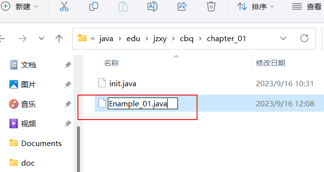
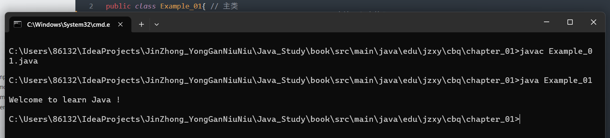

# 第一章 - Java 概述

## 1.1 Java 简介

### 1.1.1 Java 的产生与发展

### 1.1.2 Java 的特点


## 1.2 JDK 的安装与配置

### 1.2.1 认识 JDK


### 1.2.2 下载与安装 Java 开发工具包


### 1.2.3 配置环境变量


## 1.3 Java 程序的类型

### 1.3.1 开发 Java 应用程序的方法



```java
public class Example_01{
    public static void main(String args[]){
        System.out.println("Welcome to learn Java !");
    }
}
```





### 1.3.2 开发 Java 小应用程序的方法

```java
public class Example_02 extends Applet {
    String text;

    @Override
    public void init() {
        text = new String("Welcome to Learn Java !");
    }

    @Override
    public void paint(Graphics g) {
        g.drawString(text,5,20);
    }
}
```


```html
<!DOCTYPE html>
<html lang="en">
<head>
    <meta charset="UTF-8">
    <title>Example_02 AppletDemo</title>
</head>
<body>
Here`s my first Java Applet.
<applet code="./Example_02.class" width="300" height="40"></applet>
</body>
</html>
```


### 1.3.3 使用 module 开发 Java 程序的方法

```java
module first{
    
}
```

```java
package first;
public class ModuleTest{
    public static void main(String args[]){
        System.out.println("Hello Module !")
    }
}
```


## 1.4 程序注释

```java
public class Example_01{

    /**
     * main func
     * @param args args
     */
    public static void main(String args[]){ //主类
        /*main () 方法，程序入口*/
        System.out.println("Welcome to learn Java !");
    }
}

```


## 1.5 Eclipse 的简介与使用

### 1.5.1 Eclipse 简介


### 1.5.2 Eclipse 基本操作


### 1.5.3 用 Eclipse 调试程序的方法


## 1.6 InteliJ IDEA 的简介与使用

### 1.6.1 InteliJ IDEA 简介


### 1.6.2 InteliJ IDEA 基本操作


### 1.6.3 InteliJ IDEA 调试程序的方法


## 1.7 小结


## 1.8 习题

